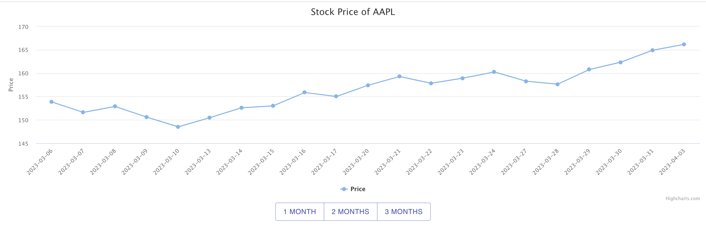

# About

This is a React frontend for displaying apple stock prices. It fetches the prices from the [backend](../apple-stock-backend/).

## Running the project

First install the dependencies:

`npm install`

and then run

`npm start`
Runs the app in the development mode.\
Open [http://localhost:3000](http://localhost:3000) to view it in the browser.

`npm test`
Launches the test runner in the interactive watch mode.\
See the section about [running tests](https://facebook.github.io/create-react-app/docs/running-tests) for more information.